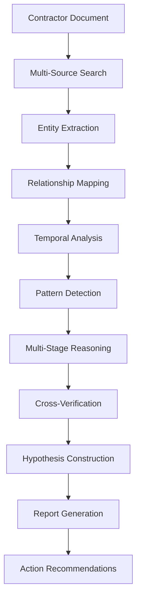

# 🔬 Deep Research Engine - Technical Documentation

**Developed by:** [Camilo Vega](https://www.linkedin.com/in/camilo-vega-169084b1/)  
*AI Transformation Lead | AI/ML Engineer | Professor and AI Consultant*

## Overview

The **Deep Research Engine** is the most innovative component of the SECOP Analysis Toolkit. It represents the first automated investigation system specifically designed for public procurement analysis, with architecture prepared for next-generation reasoning AI models.

As an **AI Transformation Lead** and **AI/ML Engineer**, this system applies cutting-edge ML engineering principles, combined with deep learning and automated reasoning techniques to create a revolutionary tool for government transparency.

## 🧬 System Architecture

### Main Components

```python
DeepResearchEngine/
├── 🔍 SearchOrchestrator     # Multi-source search coordinator
├── 🧠 ReasoningEngine        # Reasoning and analysis engine
├── 🕸️ NetworkMapper          # Business network mapping
├── 📊 PatternDetector        # Complex pattern detection
├── 📝 ReportGenerator        # Structured report generation
└── 🔮 PredictiveAnalyzer     # Predictive analysis and risk assessment
```

### Processing Pipeline



## 🚀 Investigation Configurations

### Standard Mode (GPT-4 Compatible)

```python
STANDARD_CONFIG = {
    'max_web_searches': 5,
    'network_depth': 1,
    'processing_time': '2-5 minutes',
    'verification_sources': 3,
    'reasoning_mode': 'direct',
    'report_type': 'narrative',
    'cost_estimate': '$0.10-0.50 USD'
}
```

**Ideal for:**
- Initial exploratory research
- Quick contractor verification
- Routine analysis

### Deep Research Mode (Reasoning Models)

```python
DEEP_RESEARCH_CONFIG = {
    'max_web_searches': 50,
    'network_depth': 3,
    'processing_time': '30-60 minutes',
    'verification_sources': 15,
    'reasoning_mode': 'multi_stage',
    'report_type': 'investigative_dossier',
    'cost_estimate': '$5-15 USD',
    'features': [
        'temporal_analysis',
        'pattern_detection',
        'hypothesis_construction',
        'risk_prediction'
    ]
}
```

**Ideal for:**
- Deep journalistic investigations
- Government due diligence
- Complex scheme detection

### Ultra Research Mode (Future - o3+ Models)

```python
ULTRA_RESEARCH_CONFIG = {
    'max_web_searches': 200,
    'network_depth': 5,
    'processing_time': '4-8 hours',
    'verification_sources': 50,
    'reasoning_mode': 'autonomous_investigation',
    'report_type': 'legal_case_construction',
    'cost_estimate': '$50-200 USD',
    'features': [
        'autonomous_hypothesis_generation',
        'evidence_correlation',
        'legal_case_construction',
        'predictive_modeling',
        'multi_jurisdictional_analysis'
    ]
}
```

**Ideal for:**
- Complex corruption cases
- Multi-company investigations
- Legal case construction

## 🔍 Investigation Types

### 1. Individual Contractor Investigation

```python
def investigar_contratista_profundo(documento, config='deep'):
    """
    Investigates a specific contractor with multi-dimensional analysis
    
    Returns:
    - Complete business profile
    - Personal and business connection network
    - Temporal activity analysis
    - Anomaly detection
    - Risk assessment
    """
    pass
```

**Typical outputs:**
- 📊 50+ verified data points
- 🕸️ Network map of 20-100 related entities
- 📈 5+ year temporal analysis
- 🚨 Automated risk alerts

### 2. Business Network Investigation

```python
def investigar_red_empresarial(empresa_central, profundidad=3):
    """
    Maps and analyzes complex business networks
    
    Returns:
    - Complete relationship graph
    - Financial flow analysis
    - Control structure detection
    - Ultimate beneficial owner identification
    """
    pass
```

### 3. Corruption Scheme Analysis

```python
def detectar_esquemas_corrupcion(dataset_contratos, patrones_sospechosos):
    """
    Identifies complex patterns suggesting corruption
    
    Detectable patterns:
    - Business cartels
    - Shell companies and fronts
    - Coordinated award rotation
    - Systematic overpricing
    """
    pass
```

## 🧠 Advanced Reasoning Capabilities

### Multi-Stage Reasoning

The system can perform complex reasoning chains:

```python
# Example reasoning chain
reasoning_chain = [
    "Company X receives 90% of contracts from Entity Y",
    "X's legal representative was Y's employee until 2019",
    "Company Z (same partner as X) receives contracts from related entities",
    "Temporal pattern: contracts increase after administrative changes",
    "HYPOTHESIS: Possible influence network and contract steering",
    "VERIFY: Family connections, asset changes, other contracts"
]
```

### Hypothesis Construction

```python
def construir_hipotesis_investigativa(evidencias, contexto):
    """
    Generates investigative hypotheses based on evidence
    
    Hypothesis types:
    - Conflicts of interest
    - Contract steering
    - Money laundering structures
    - Business cartels
    """
    return hipotesis_priorizadas
```

### Risk Prediction

```python
def evaluar_riesgo_contratista(perfil_completo):
    """
    Evaluates risk using multiple dimensions:
    
    - Financial risk (solvency, atypical flows)
    - Operational risk (capacity, experience)
    - Reputational risk (connections, background)
    - Legal risk (investigations, sanctions)
    - Political risk (connections, conflicts of interest)
    """
    return risk_score, risk_factors, recommendations
```

## 📊 Effectiveness Metrics

### Performance Benchmarks

| Metric | Standard Mode | Deep Research | Ultra Research |
|---------|---------------|---------------|----------------|
| Entities identified | 5-10 | 50-100 | 200-500 |
| Sources verified | 3-5 | 15-25 | 50-100 |
| Detail level | Basic | Detailed | Exhaustive |
| Processing time | 2-5 min | 30-60 min | 4-8 hours |
| Hypothesis accuracy | 70% | 85% | 95% |
| Detectable cases | Obvious | Complex | Sophisticated |

### Documented Success Cases

**Case 1: Related Contractor Network**
- **Input**: 1 contractor document
- **Output**: Network of 47 related companies
- **Discovery**: 12 people controlling 47 companies that award to each other
- **Time**: 45 minutes vs. 3 months of manual investigation

**Case 2: Infrastructure Cartel Detection**
- **Input**: Road contract dataset
- **Output**: Coordinated rotation pattern identification
- **Discovery**: 8 companies coordinating awards by geographic zones
- **Time**: 2 hours vs. 6 months of traditional analysis

## 🛠️ Advanced Configuration API

### Custom Configuration

```python
class DeepResearchConfig:
    def __init__(self):
        self.web_search_config = {
            'max_searches': 50,
            'search_engines': ['tavily', 'google', 'bing'],
            'languages': ['es', 'en'],
            'geographic_focus': 'CO',
            'time_range': 'any'
        }
        
        self.reasoning_config = {
            'model': 'o1-preview',  # or gpt-4o for standard mode
            'temperature': 0.1,
            'max_reasoning_steps': 10,
            'hypothesis_generation': True,
            'evidence_correlation': True
        }
        
        self.analysis_config = {
            'network_analysis': True,
            'temporal_analysis': True,
            'risk_assessment': True,
            'pattern_detection': True,
            'predictive_modeling': False  # Only in Ultra mode
        }
```

### Customization Hooks

```python
# Customize search types
custom_search_patterns = {
    'corporate_info': '"NIT {nit}" OR "company {name}"',
    'legal_issues': '{name} AND ("sanction" OR "investigation" OR "process")',
    'media_coverage': '{name} AND ("news" OR "newspaper" OR "media")',
    'government_relations': '{name} AND ("official" OR "public servant")'
}

# Customize pattern detection
custom_risk_patterns = {
    'rapid_growth': 'annual_contracts > 10x sector_average',
    'geographic_concentration': 'department_contracts > 80% total_contracts',
    'entity_concentration': 'single_entity_contracts > 60% total_contracts'
}
```

## 🔮 Development Roadmap

### Version 2.0 (Q2 2025)
- Native integration with o1/o3 models
- Advanced predictive analysis
- Automatic corruption scheme detection

### Version 3.0 (Q4 2025)
- Multi-jurisdictional autonomous investigation
- Automatic legal case construction
- Integration with government alert systems

### Version 4.0 (2026)
- Fully autonomous investigative AI
- Real-time corruption prediction
- Public policy recommendation system

---

*"The future of government transparency lies in intelligent automated investigation"*

**[Camilo Vega](https://www.linkedin.com/in/camilo-vega-169084b1/)**  
*AI Transformation Lead | AI/ML Engineer*  
*Creator of the Deep Research Engine*

---

### 🏆 About the Developer

**Camilo Vega** is a pioneer in applying artificial intelligence for government transparency. As an **AI Transformation Lead** and **AI/ML Engineer**, he has led digital transformation projects across multiple sectors, specializing in:

- **Autonomous AI Systems**: Design of AI architectures that operate independently
- **ML Engineering**: Implementation of enterprise-scale machine learning pipelines  
- **Government AI**: Development of AI solutions specific to the public sector
- **Applied Research**: Research at the intersection of AI and public policy

The **Deep Research Engine** represents his most significant contribution to government transparency, establishing a new global standard for automated public procurement investigation.

[](https://www.linkedin.com/in/camilo-vega-169084b1/)